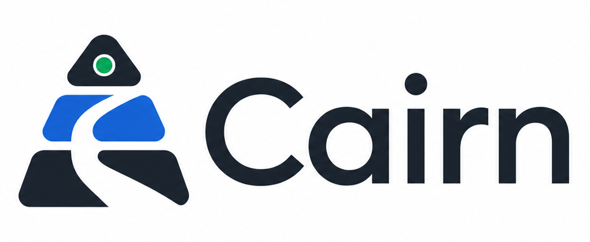

<p align="center">
  
</p>

<p align="center">
  面向软件研发团队的企业知识与研发协作平台
</p>

<p align="center">
  统一知识检索 · 项目任务图 · Agent 编排 · 多模型接入 · 企业私有部署
</p>

> [!IMPORTANT]
> Cairn 当前交付前沿为 Stage 3A Task 19。真实 PostgreSQL 16/pgvector、S3 兼容 MinIO、独立 Worker、项目工作台和项目知识工作区已交付。Task 19 以 `/projects` 作为登录后默认入口，将旧 `/documents` 与 `/ask` 书签安全重定向到项目工作台，并移除了 Node mock、旧通用文档/问答界面和手写 `@cairn/contracts`；Web 网络契约统一由 OpenAPI 生成的 `@cairn/sdk` 校验。全文格式化预览、生成式回答、周期性资源详情轮询，以及由核心命令托管 Worker/假 Embedding 的完整浏览器摄取闭环仍在后续任务。
>
> Task 15 真实知识搜索结果已交付，展示服务端排序的摘录、文件类型、类型化 locator 定位信息、混合检索标签与关键词降级结果，并覆盖取消、错误、会话失效和访问权撤销状态。Task 16 搜索卡片内按需引用上下文与授权下载已交付：引用上下文以“前文 → 命中片段 → 后文”展示纯文本，重新展开会重新授权；下载只把新标签页导航到 Identity API，实时授权后由 `307` 重定向到短时效对象地址，Web 不缓存或读取最终预签名 URL。
>
> Task 17 真实上传批次已交付：`/projects/:projectId/knowledge` 仅向 `canWrite` 用户提供文件选择和拖放，最多 20 个文件先完成校验与 SHA-256 摘要，再以最多 2 个并发 `PUT` 直传对象存储并显示逐文件进度，随后调用 `complete` 确认；批次每 2 秒跟踪一次，终止或首次查询满 5 分钟后停止自动跟踪，保留手动刷新且不伪造处理失败。取消只停止当前浏览器操作，已确认的服务端任务仍会继续；可重试的传输或 `complete` 失败使用全新批次与预签名 URL，`contract` 错误不允许重试。
>
> Task 18A Web 资源详情已交付：资源行按需内联展开，通过生成 SDK、Cookie credentials 和真实 `GET /api/v1/projects/{project_id}/knowledge/resources/{resource_id}` 读取详情。收起会取消请求并销毁局部详情，项目切换或会话代际变化同样取消并销毁旧状态；重新展开和手动刷新都会重新授权，请求中及离线等待期间隐藏旧详情和下载，并禁用自动重连刷新，不进行周期轮询。详情展示安全元数据与处理状态，并把已知失败码映射为安全中文错误指引；仅 `latestVersion.status=ready` 时提供指向 Identity API 的新标签页下载，Web 不读取或缓存最终预签名 URL。详情 `404` 会重新检查当前资源列表，并只把当前搜索标记 stale，不自动重跑搜索；资源列表仍为 `200` 时保留工作区，列表 `404` 才隐藏工作区。
>
> Task 18B 资源操作已交付：仅最新资源列表声明 `canWrite` 且 `latestVersion.status=failed`、服务端返回 `latestVersion.retryable=true` 时显示重试；重试使用当前 CSRF 和请求中的精确 `resource_id`/`version_id`，成功必须是 `200`，且返回体 `id` 与请求 `resource_id`、`latestVersion.id` 与请求 `version_id` 匹配。软删除使用列出当前资源名的行内确认，取消不发送请求，确认后严格接受 `204` 空响应；变更不自动重试或离线回放，取消只取消浏览器操作且不承诺回滚。删除会先取消当前项目相关的列表、详情、引用和搜索读取，再清理其缓存并重置当前项目可见搜索而不自动发起 `POST`，保留其他项目和上传跟踪。`401 session_invalid` 由 MutationCache 清理会话，已取消操作的迟到 `401` 不会使新会话失效；`404` 重检列表并按列表 `200`/`404` 决定局部资源或工作区隐藏，`409` 先刷新详情，契约错误须手动详情恢复后才重新提供操作。
>
> 最新 Web 壳与项目工作台已完成响应式和可访问性抛光：知识向导“岑宁”使用透明全身图与视觉居中的 Q 版紧凑头像，项目选择控件与当前任务区域建立明确关联，独立状态区域播报选择变化，真实浏览器验收覆盖 360/768/1280 像素及亮暗主题。这是现有 Web 边界的界面完善，不增加新的 Stage 3A Task 或 API 契约。

## 当前交付快照

| 边界 | 当前状态 |
|---|---|
| Web | 项目知识页已接入真实上传批次和 Task 18A 资源详情；详情按需读取、重新授权、离线隐藏旧数据且仅 ready 版本提供安全下载。提供校验、SHA-256 绑定直传进度、complete、批次状态、停止自动跟踪、手动刷新和全新批次上传重试。身份、项目/任务和项目知识工作区连接真实 FastAPI；知识资源列表展示元数据、处理状态、只读权限和游标续页，项目知识搜索展示服务端排序摘录、文件类型、类型化 locator、混合检索/关键词降级模式，并在搜索卡片内按需展开“前文 → 命中片段 → 后文”纯文本和打开授权下载。重新展开会重新授权；下载只把新标签页导航到 Identity API，由实时授权后的 `307` 进入短时效对象地址，Web 不缓存或读取最终预签名 URL。应用壳与项目工作台已完成响应式和可访问性抛光；知识向导“岑宁”使用透明全身图和视觉居中的 Q 版紧凑头像，项目选择控件与当前任务区域建立明确关联，独立状态区域播报选择变化，验收覆盖 360、768、1280 像素及亮暗主题。查询和变更请求返回规范化 `401 session_invalid` 时，统一清理本地会话与查询缓存、重置变更缓存并回到登录页。 |
| API / SDK | FastAPI 已提供会话、项目/任务、RBAC/ACL、知识摄取、资源与混合搜索契约；生成 SDK 导出 OpenAPI schema 与运行时校验器，Web API 适配器使用该校验器检查身份、项目/任务和知识响应，并对 OpenAPI `date-time` 字段执行运行时校验。 |
| Worker | 独立 Worker 已进入知识摄取核心链路；Python Worker 通过 PostgreSQL 持久化任务完成受限归档、解析、切分、Embedding 与原子索引发布。 |
| 基础设施 | 核心开发链路使用 PostgreSQL 16/pgvector 与 S3 兼容 MinIO；Redis、正式 Compose/Helm 部署和 OpenTelemetry 仍在规划。 |
| 延后 | 全文格式化预览、生成式回答、周期性资源详情轮询、核心 Worker/假 Embedding 浏览器摄取闭环、连接器、Agent 执行和完整模型 Provider 策略层尚未交付。 |

## Stage 3A Task 1–19 已交付边界

共享 API 契约、响应式 Web 与真实身份基础已经完成。阶段 2 已完成并交付项目、任务、依赖、状态机、事务性 Outbox 和有界 SSE 查询；Cairn 已完成阶段 2.5A，交付组织角色、项目 ACL 与成员角色管理 API；Stage 3A Task 1–11 已交付文件摄取和可发布索引基础，Task 12 混合搜索 API、Task 13 Web 知识工作区基础、Task 14 真实知识资源列表与 Task 15 真实知识搜索结果均已交付。Task 16 搜索卡片内按需引用上下文与授权下载已交付。Task 17 真实上传批次已交付。

- `@cairn/sdk` 统一 Web 使用的 OpenAPI 网络契约与运行时校验；
- Web 保留本地容错、请求取消、查询缓存和 UI 状态边界；
- 工作台支持 360、768、1280 像素布局，以及日间、夜间和跟随系统偏好；
- 已登录用户可在 Web 项目视图中查看游标分页的项目和任务，并通过服务端状态机更新任务状态；
- 组织、用户、成员、Cookie 会话、登录限流状态和审计写入 PostgreSQL，Web 身份请求连接 FastAPI；
- 项目、任务、依赖、审计行和 Outbox 事件写入 PostgreSQL；每次已接受的命令在同一事务中提交业务变更、审计记录和事件；
- 项目读取和写入在数据库查询中同时应用组织边界、成员角色与规范化 ACL，不先取回无权资源再隐藏；
- Web 项目页把 `viewer` 的任务视图呈现为只读；服务端始终是授权权威；
- 项目可以一次创建 1–20 个文件的上传批次，客户端通过绑定 SHA-256 校验和的 S3/MinIO 预签名 `PUT` 直传对象；
- 独立 Worker 从 PostgreSQL 租用持久化任务，执行受限 ZIP 展开、支持文档解析、结构化切分、OpenAI 兼容的 1024 维 Embedding 和原子索引发布；
- 项目知识搜索在候选限制前应用组织、项目、当前版本、资源状态与 ACL 过滤，并以关键词和 pgvector 结果执行确定性混合排序；
- Web 已提供受保护的 `/projects/:projectId/knowledge` 工作区，接入真实资源分页与搜索；资源列表显示标题、文件类型、大小、更新时间及处理状态，搜索结果按服务端顺序显示摘录、文件类型、类型化 locator 定位信息和混合检索/关键词降级标签，并保持取消、错误、会话失效、访问权撤销与响应式应用壳边界；
- 搜索卡片可按需展开“前文 → 命中片段 → 后文”纯文本；重新展开会重新授权。下载只把新标签页导航到 Identity API，实时授权后由 `307` 重定向到短时效对象地址；Web 不缓存或读取最终预签名 URL；
- 项目知识页真实上传支持逐文件进度、ZIP 子条目与部分失败，传输或 complete 重试创建全新批次。
- Task 18A 资源详情按需读取真实 GET；收起、项目切换与会话代际变化取消请求并销毁局部状态，重新展开与手动刷新重新授权，离线等待隐藏旧数据，且不自动重连刷新或周期轮询。只有 ready 最新版本显示 Identity API 新标签页下载。
- Task 18B 资源操作支持 writer 且失败版本由服务端声明可重试时的版本重试，以及列出资源名的行内软删除确认。重试使用当前 CSRF、精确资源/版本 ID 并校验精确 `200` 返回；删除取消不发 `DELETE`，确认严格接受 `204` 空响应。变更不自动重试或离线回放；删除清理当前项目的相关读取、详情/引用缓存和搜索结果而不自动搜索，保留其他项目和上传跟踪，`404` 列表重检、`409` 详情刷新、契约错误手动恢复和取消迟到 `401` 会话隔离均已交付。
- 对象存储公开 `PUT` URL 必须与 Web 页面使用不同 origin；客户端拒绝同源上传 URL，避免浏览器自动携带同源 Cookie。对象存储 `PUT` 不携带 Identity credentials；预签名上传 URL 与签名 headers 仅存于局部运行时，不进入 DOM、Query/Mutation 缓存、日志或浏览器存储。文件与 ZIP 子条目展示安全状态和局部错误，完成确认及批次终止时刷新资源列表，搜索仅标记 stale，不自动重跑。取消、路由切换、批次替换和会话失效会停止未完成的浏览器操作；自动跟踪超时保留已知 queued/processing 事实，显示“后台仍在处理”并允许手动刷新。
- 应用壳使用单一专用 Cairn wordmark；亮暗主题下图片背景与顶栏融合，资源加载失败时回退为可访问的文字品牌；
- Web 壳与项目工作台完成响应式和可访问性抛光：知识向导“岑宁”使用透明原创全身图与视觉居中的 Q 版紧凑头像，项目选择控件与当前任务区域建立明确关联，独立状态区域播报选择变化，保留 360/768/1280 像素及亮暗主题验收；
- 登录后默认进入 `/projects`；旧 `/documents` 与 `/ask` 书签在会话边界内重定向到项目工作台。`/projects/:projectId/knowledge` 的资源、详情、搜索、引用上下文/授权下载、真实上传批次和资源操作均连接真实 API。

## 项目与任务 API

所有端点都从受保护会话解析 `CurrentIdentity`。其中的组织是租户权威；客户端请求体不接受可信 `org_id`、创建者或 actor 字段。项目详情与任务读写对缺失或跨租户资源返回 `404 not_found`，隐藏普通资源的存在性。事件查询采用单独的非泄露语义：

- `events` 查询不存在的项目 ID：返回 `200` 空 `text/event-stream`，不泄露项目是否存在；
- `events` 查询跨租户项目 ID：返回 `200` 空 `text/event-stream`，同样不泄露项目是否存在。

| 操作 | 端点 | 已交付语义 |
|---|---|---|
| 创建、分页列出项目 | `POST /api/v1/projects`、`GET /api/v1/projects` | 创建项目；使用稳定不透明游标读取当前组织项目 |
| 读取项目 | `GET /api/v1/projects/{project_id}` | 仅返回当前组织中的项目 |
| 创建、分页列出任务 | `POST /api/v1/projects/{project_id}/tasks`、`GET /api/v1/projects/{project_id}/tasks` | 创建任务；在项目内使用稳定不透明游标分页 |
| 转换任务状态 | `PATCH /api/v1/tasks/{task_id}/status` | 由服务端状态机校验转换，不接受任意状态跳转 |
| 添加任务依赖 | `POST /api/v1/tasks/{task_id}/dependencies` | 请求体中的前置任务指向路由中的后继任务，形成 predecessor → successor |
| 查询项目事件 | `GET /api/v1/projects/{project_id}/events` | 按当前组织和项目 aggregate 过滤，返回一次最多 100 条、随后结束的 SSE 批次；不存在或跨租户 ID 均为空 `200` |
| 列出组织成员 | `GET /api/v1/organizations/{organization_id}/memberships` | `owner` 与 `admin` 可使用稳定游标分页读取当前组织成员 |
| 更新成员角色 | `PATCH /api/v1/organizations/{organization_id}/memberships/{membership_id}` | 按角色矩阵更新成员；最后一名 `owner` 不能被降级 |
| 列出项目 ACL | `GET /api/v1/projects/{project_id}/acl` | 需要项目 `manage` 权限；只列出当前有效条目 |
| 设置项目 ACL | `PUT /api/v1/projects/{project_id}/acl/{principal_type}/{principal_id}` | 幂等设置 `read`、`write` 或 `manage` |
| 撤销项目 ACL | `DELETE /api/v1/projects/{project_id}/acl/{principal_type}/{principal_id}` | 幂等撤销当前有效条目并保留历史行 |

`Project` 是阶段 2 的聚合根：任务创建、状态变化和依赖边都以所属项目作为 Outbox aggregate，项目事件查询也按组织与项目共同隔离。项目与任务列表的 `limit` 为 1–100，默认 50；响应通过 `nextCursor` 续页。

## 组织 RBAC 与项目 ACL

项目权限按 `read < write < manage` 递增：`write` 包含 `read`，`manage` 包含两者。创建项目时会授予当前组织 `read` 和创建者用户 `manage`；其他有效的 `org`、`role`、`user` ACL 取最高权限。角色矩阵如下：

| 组织角色 | 项目与成员能力 |
|---|---|
| `owner` | 对当前组织所有项目隐式拥有 `manage`；可创建项目、列出成员并更新任意成员角色 |
| `admin` | 对当前组织所有项目隐式拥有 `manage`；可创建项目、列出成员，只能在 `member` 与 `viewer` 之间切换角色 |
| `member` | 可创建项目；对其他项目仅拥有匹配 ACL 授予的权限，不能管理成员角色 |
| `viewer` | 不能创建项目；ACL 即使授予 `write` 或 `manage`，有效权限上限仍为 `read`，不能管理成员角色 |

项目详情、任务读写和 ACL 操作对不存在、跨组织或权限不足的项目统一返回 `404 not_found`，避免暴露项目存在性。成员列表对当前组织中无管理权的 `member`/`viewer` 返回 `403 forbidden`；跨组织或不可见的成员目标返回 `404 not_found`。降级最后一名所有者返回 `409 last_owner_required`。

Cookie 会话下的成员 `PATCH` 与 ACL `PUT`/`DELETE` 都要求合法 Origin 和会话绑定的 `X-CSRF-Token`。实际角色或 ACL 变化会把业务变更、追加式审计记录和 Outbox 事件放在同一事务提交；重复设置相同值和撤销不存在的 ACL 是无副作用的幂等成功，不新增审计或 Outbox 事件。

## 知识摄取、资源与搜索 API

Stage 3A Task 1–12 在项目授权边界内提供上传批次状态、资源列表/详情、失败版本重试、软删除、下载重定向、切片引用上下文和项目范围混合搜索。知识资源的不存在、跨组织和权限不足统一使用不泄露的 `404 not_found`；所有变更端点和搜索 `POST` 在 Cookie 会话下都要求合法 Origin 和 `X-CSRF-Token`。下载会重新授权，然后返回指向短时效对象 URL 的 `307`。

| 操作 | 端点 |
|---|---|
| 创建上传批次 | `POST /api/v1/projects/{project_id}/knowledge/uploads` |
| 确认单个直传对象 | `POST /api/v1/projects/{project_id}/knowledge/uploads/{upload_id}/complete` |
| 查询批次处理状态 | `GET /api/v1/projects/{project_id}/knowledge/batches/{batch_id}` |
| 分页列出知识资源 | `GET /api/v1/projects/{project_id}/knowledge/resources` |
| 读取资源与最新版本 | `GET /api/v1/projects/{project_id}/knowledge/resources/{resource_id}` |
| 重试可重试的失败版本 | `POST /api/v1/projects/{project_id}/knowledge/resources/{resource_id}/versions/{version_id}/retry` |
| 软删除资源 | `DELETE /api/v1/projects/{project_id}/knowledge/resources/{resource_id}` |
| 重新授权并下载 | `GET /api/v1/projects/{project_id}/knowledge/resources/{resource_id}/download` |
| 读取命中切片及前后文 | `GET /api/v1/projects/{project_id}/knowledge/resources/{resource_id}/chunks/{chunk_id}` |
| 权限过滤的关键词/向量混合搜索 | `POST /api/v1/projects/{project_id}/knowledge/search` |

## 显式延后

- 完整阶段/里程碑编辑 UI、React Flow/ELK 图编辑、拖拽 Kanban 和时间线可视化延后；
- Outbox worker 发布、长连接重连 SSE、Redis fan-out、评论、通知和任务执行延后；
- 群组、邀请和成员移除未实现；ACL 管理 UI 与成员管理 UI 未实现；
- Bearer/OIDC 延后；知识摄取与项目范围混合搜索 API、真实 Web 知识资源、Task 18 详情与操作、搜索、引用上下文/授权下载及上传批次已交付。全文格式化预览、生成式回答、周期性详情轮询和完整 Worker 浏览器闭环仍在后续任务；连接器、Agent 执行和完整模型 Provider 策略层尚未交付。

## 核心能力

| 能力 | 目标 |
|---|---|
| 企业智能搜索 | 从文档、代码、项目、任务、Agent 运行与产物中统一检索，并提供权限过滤和可追溯引用 |
| 项目与任务管理 | 使用阶段、里程碑、任务 DAG、依赖和验收标准规划并跟踪研发项目 |
| Agent 协作 | 将任务分配给人员、内置 Agent 或外部 Agent，统一管理运行、审批、预算与产物 |
| 实时进度 | 查看节点状态、日志、成本、阻塞关系和执行历史，并支持取消、恢复与重试 |
| 可视化产出 | 从结构化任务、依赖、代码和事件数据生成流程图、路线图与项目报告 |
| 多模型与跨平台 | 统一接入多种云端或内网模型，并覆盖 Web、桌面、移动端、VS Code 与 CLI |

## 技术栈

<p align="center">
  
  &nbsp;
  
  &nbsp;
  
  &nbsp;
  
  &nbsp;
  
  &nbsp;
  
  &nbsp;
  
  &nbsp;
  
  &nbsp;
  
  &nbsp;
  
</p>

为避免把路线图写成已完成功能，下表区分当前原型已经使用的技术与目标架构中的规划技术。

| 领域 | 技术选择 | 状态 |
|---|---|---|
| Web | React 19、TypeScript 5、Vite 7、Zod | 当前已使用 |
| Web 数据与图形 | React Router、TanStack Query、React Flow、ELK.js、Mermaid | Router/Query 当前已使用；其余规划 |
| 桌面与移动 | Tauri、React Native、Expo | 规划 |
| API | Python 3.12、FastAPI、Pydantic Settings、Uvicorn | 当前已使用 |
| API 数据访问 | SQLAlchemy 2、Alembic | 当前已使用 |
| 数据与文件 | PostgreSQL、pgvector、Redis、S3/MinIO | PostgreSQL 16/pgvector 与 S3 兼容 MinIO 当前已使用；Redis 规划 |
| 后台摄取 | Python Worker、PostgreSQL 持久化任务、结构化解析与切分 | 当前已使用 |
| 工作流与 Agent | Temporal、LangGraph、AgentRunner | 规划 |
| 模型接入 | OpenAI 兼容 Embedding；LiteLLM Gateway 与 Cairn 模型策略层 | 1024 维 Embedding 当前已使用；完整策略层规划 |
| 实时与可观测 | Transactional Outbox、SSE、OpenTelemetry | Outbox 与有界 SSE 查询当前已使用；OpenTelemetry 规划 |
| 部署 | Local Web、Docker Compose、Kubernetes/Helm | Docker Compose 当前用于核心开发；正式部署规划 |
| 测试与工具 | pnpm、Vitest、Testing Library、Playwright；uv、pytest、Ruff、Pyright | 当前已使用 |

## 架构

当前实现、目标组件、安全不变量与阶段路线见 [公开架构说明](docs/architecture.md)。文档中的“当前已交付”和“规划”状态是功能边界，不应互相替代。

## 项目结构

以下目录树只列出公开维护的源码、测试与工程入口，不包含私有文档、依赖缓存和构建产物。

```text
Cairn
├── apps/
│   ├── api/                  # FastAPI 工程基线
│   │   ├── src/cairn_api/    # API 应用、配置、中间件与错误契约
│   │   └── tests/            # pytest 测试
│   ├── web/                  # React/Vite Web 原型
│   │   ├── scripts/          # Web 测试、构建与浏览器验收脚本
│   │   ├── src/              # 页面、组件、查询、会话与数据契约
│   │   ├── styles/           # 全局样式
│   │   └── tests/            # Node 契约测试与 React 组件测试
│   └── worker/               # 知识摄取 Worker、解析器、切分、Embedding 与索引
├── packages/
│   └── sdk/                  # 从 FastAPI OpenAPI 生成的身份、项目任务与知识客户端
├── assets/brand/             # Cairn 品牌图片
├── deploy/compose/           # PostgreSQL/pgvector 与 MinIO 核心开发基础设施
├── scripts/                  # 跨 package 的任务编排与进程工具
├── package.json              # 根命令与 Node.js 工程约束
├── pnpm-workspace.yaml       # pnpm workspace 定义
├── pyproject.toml            # Python workspace 与工具配置
└── uv.lock                   # Python 依赖锁文件
```

## 最终部署形式

正式 Local Web、单服务器私有部署和 Kubernetes 私有部署将共享同一套 API、数据库迁移和应用镜像。当前核心开发链路已有真实 API、PostgreSQL/pgvector、MinIO、独立 Worker 和 Web；项目与项目知识操作连接真实 API，正式部署能力仍在建设中。

| 形式 | 默认入口 | 定位 |
|---|---|---|
| Local Web | `http://127.0.0.1:8080` | 本机一条命令启动真实 Web、API 和持久化依赖 |
| Docker Compose | 企业域名或内网地址 | 中小企业单服务器私有部署 |
| Kubernetes/Helm | 企业 Ingress 或网关 | 集群、高可用和外部基础设施接入 |
| 隔离网络 | 内网地址 | Compose/Helm 配合私有镜像仓库、内网模型和离线安装包 |

## 当前核心开发

环境要求：Node.js 22+、pnpm 10+、Python 3.12+、uv 和已启动的 Docker Desktop。

首次安装并启动：

```bash
pnpm install
uv sync --all-packages --all-groups
pnpm infra:up
pnpm dev:core
```

`pnpm infra:up` 启动 PostgreSQL 16/pgvector 和 MinIO，并幂等初始化对象存储 bucket 与 CORS。需要处理摄取任务时，在另一终端启动独立 Worker：

```bash
pnpm worker:preflight
pnpm dev:worker
```

`pnpm worker:preflight` 只校验数据库、对象存储和当前 Embedding Profile/Provider 依赖；`pnpm dev:worker` 持续处理任务。调试一个当前可租用任务时使用 `pnpm worker:once`。

- 登录：`http://localhost:5500`
- Web：`http://localhost:5500`
- Identity API：`http://127.0.0.1:8080`

`pnpm dev:core` 会先执行迁移和幂等演示种子，再托管 API 与 Web；Worker 依然是独立进程。演示身份只允许在开发或测试环境写入；生产环境会拒绝演示种子、示例 CSRF 密钥和不安全 Cookie。按 `Ctrl+C` 停止该命令只终止 API 与 Web，不删除 PostgreSQL 或 MinIO 开发卷；再次启动会复用已有数据。

若本机 5432 已被其他 PostgreSQL 占用，可让 `CAIRN_POSTGRES_PORT` 与 `DATABASE_URL` 同时改用同一个空闲端口；不要只改其中一项。

生产环境必须使用 HTTPS `APP_URL`/`CORS_ORIGINS`、安全 Cookie，并分别配置至少 32 字节且不能复用的 `CAIRN_CSRF_SECRET` 与 `CAIRN_AUTH_RATE_LIMIT_SECRET`。生产配置会拒绝示例密钥、HTTP Origin 和不安全 Cookie。只有直接连接且受信任的反向代理才能写入转发链；将其网段以逗号分隔配置到 `CAIRN_TRUSTED_PROXY_CIDRS`，并确保代理覆盖客户端提交的 `Forwarded`/`X-Forwarded-*` 请求头。

## 当前 API 基线

环境要求：Python 3.12+、uv。

独立调试 API 时可运行：

```bash
uv sync --all-packages --all-groups
pnpm dev:api
```

- API：`http://127.0.0.1:8080`
- 存活探针：`http://127.0.0.1:8080/health`
- 版本探针：`http://127.0.0.1:8080/api/v1`
- OpenAPI：`http://127.0.0.1:8080/docs`

API 现已提供 PostgreSQL 与对象存储 readiness、登录、会话恢复、注销、当前组织、项目任务、成员角色、项目 ACL 与上述知识资源和混合搜索接口。登录失败限制由 PostgreSQL 持久化：同一规范化邮箱在 15 分钟窗口内最多失败 5 次，同一来源 IP 最多失败 30 次，达到阈值后阻止 15 分钟；表中仅保存使用 `CAIRN_AUTH_RATE_LIMIT_SECRET` 生成的 HMAC 摘要，不保存明文邮箱或 IP。项目知识页真实上传使用 Identity API 与对象存储。

当前切片不包含 Bearer/OIDC、群组、邀请、成员移除、ACL/成员管理 UI、全文格式化预览、生成式回答、周期性资源详情轮询、核心 Worker/假 Embedding 浏览器摄取闭环、连接器、Agent 任务执行或完整 AI Provider 策略层。Task 18 资源详情与操作和 Task 19 Mock 退场已交付；AI Provider 与外部 Agent 接入必须建立在组织、权限、审计、项目和知识基础完成之后，不能绕过这些边界提前扩展。

可按需清理过期或已撤销的认证状态：

```bash
pnpm auth:cleanup
```

该命令分批、幂等删除过期/已撤销会话与失效限流桶，保留有效会话、活动限流窗口和全部审计记录；数据库错误会返回非零退出码。

## 质量检查

```bash
pnpm typecheck
pnpm test
pnpm build
pnpm test:worker
pnpm lint:worker
pnpm typecheck:worker
pnpm verify:core
pnpm verify
```

`pnpm verify:core` 会创建独立 Compose project 和临时 PostgreSQL/MinIO 卷，执行对象存储初始化与往返、迁移、真实 API 集成测试、SDK 漂移检查、生产构建与 Chromium 登录闭环。最后一段验收会用 OpenSSL 生成仅供本次运行使用的 localhost 证书，在 HTTPS 反向代理后启动生产配置 API，并验证 CORS、Secure/HttpOnly/SameSite Cookie、会话恢复、CSRF 注销和可信来源 IP。临时证书、进程及 Compose project 会在成功、失败或信号中断后清理；该命令不会接触开发数据库和卷。

`pnpm verify` 是完整的跨 package 门禁：它覆盖 OpenAPI 生成 SDK 测试与漂移检查、Web、API、Worker、Ruff、Pyright、发行包构建与最后的真实核心验证。浏览器部分使用生产构建，覆盖登录、刷新恢复、组织显示、注销、兼容路由、360/768/1280 像素布局、亮暗主题、真实项目与项目知识导航、上传、搜索、引用上下文、资源重试/删除、长内容换行、触摸目标、无横向溢出和品牌像素契约。Worker package 测试覆盖租约、归档、解析、切分、Embedding 与原子索引语义；真实核心验证覆盖 pgvector、MinIO 对象往返、项目范围混合搜索和知识 API/SDK 一致性。Task 20 将补充核心命令托管 Worker/假 Embedding 的完整浏览器摄取闭环。

也可以使用 `pnpm test:sdk`、`pnpm typecheck:sdk`、`pnpm check:sdk`、`pnpm test:web`、`pnpm test:api`、`pnpm typecheck:web`、`pnpm typecheck:api`、`pnpm test:worker`、`pnpm lint:worker`、`pnpm typecheck:worker`、`pnpm build:web` 和 `pnpm build:api` 分别检查单个 package 或生成契约。

## 开源许可证

Cairn 采用 [ISC License](LICENSE) 开源。
